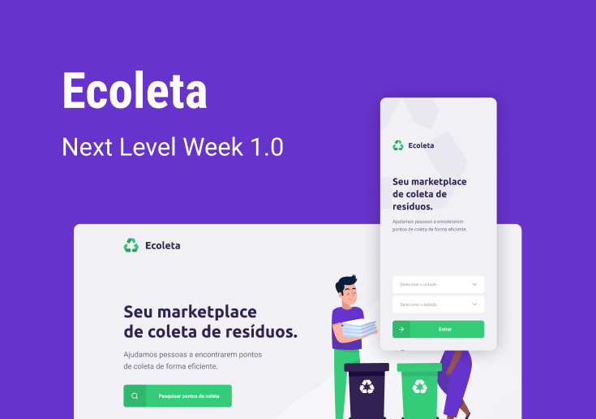

  <h1 align="center"> Rocketseat - Next Level Week 1ª Edição </h1>
  
Projeto desenvolvido com as melhores e mais atuais tecnologias para desenvolvimento web

  
  

  
  <h3>Tecnologias Utilizadas (FullStack)</h3>
  

    Linguagem: Typescript 
    Back-End(APIRESTful): NodeJS, express, celebrate, sqlite 
    Front-End: ReactJS 
    Mobile: React Native - expo

